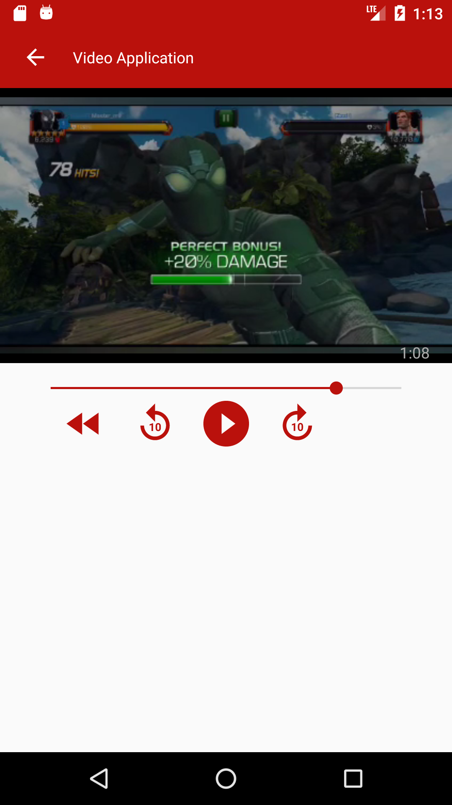
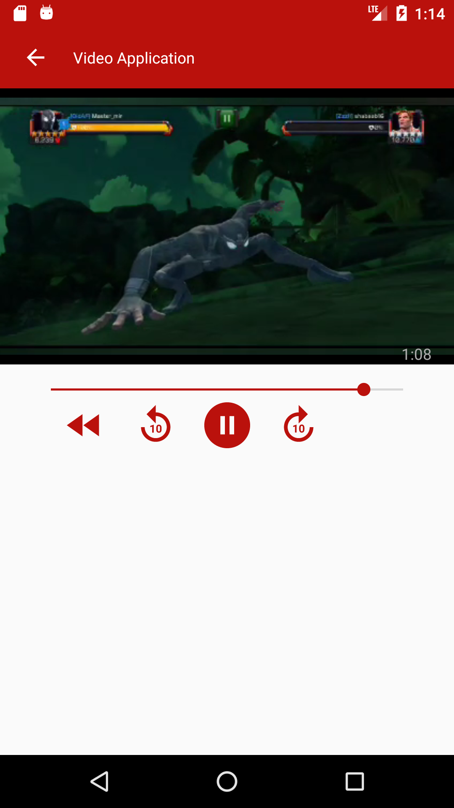

# TestApplication

Task 1: https://github.com/shitab14/TestApplication/tree/master/app/src/main/java/com/mr_mir/testapplication/anagram 
Sample Unit Test: https://github.com/shitab14/TestApplication/tree/master/app/src/androidTest/java/com/mr_mir/testapplication/anagram
Task 2:
a)  https://github.com/shitab14/TestApplication/tree/master/app/src/main/java/com/mr_mir/testapplication/implementinginterface (using the interface)
b) https://github.com/shitab14/TestApplication/tree/master/app/src/main/java/com/mr_mir/testapplication/implementingSingleton  (using Singleton pattern)
Task 3: https://github.com/shitab14/TestApplication/tree/master/app/src/main/java/com/mr_mir/testapplication/videoplayer (Video Application using MVVM Pattern and Retrofit)
I used MVVM Pattern to fetch data from API because firstly MVVM is recommended by Google and I personally use it in my development using LiveData.
You can find the APK of the application here: https://github.com/shitab14/TestApplication/tree/master/apk

